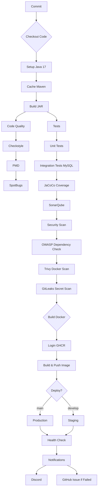

# QUESTION 3 – CONCEPTION DU PIPELINE

## 3.1 Analyse et strategie CI/CD

### A. Strategie de branches

**Modele choisi: GitFlow**

GitFlow est adapte aux projets avec cycles de release reguliers et permet une separation claire entre le developpement, les releases et la maintenance.

#### Noms des branches

| Branche | Role | Protection |
|---------|------|------------|
| `main` | Production - code stable | 2 reviews, status checks passes |
| `develop` | Integration - code en cours | 1 review, status checks passes |
| `feature/*` | Nouvelles fonctionnalites | Merge via PR vers develop |
| `hotfix/*` | Corrections urgentes | Merge via PR vers main ET develop |
| `release/*` | Preparation release | Merge vers main et develop |

#### Regles de protection des branches

**Pour `main`:**
- Require pull request reviews before merging: **2 reviews**
- Require status checks to pass before merging: **Oui**
- Require branches to be up to date: **Oui**
- Do not allow force pushes: **Oui**
- Require linear history: **Optionnel**

**Pour `develop`:**
- Require pull request reviews before merging: **1 review**
- Require status checks to pass before merging: **Oui**

---

### B. Declencheurs du pipeline

```yaml
on:
  push:
    branches: [main, develop]
  pull_request:
    branches: [main, develop]
  release:
    types: [published]
  schedule:
    # Nightly build - Security scan every jour a 2 AM
    - cron: '0 2 * * *'
  workflow_dispatch:
    inputs:
      environment:
        description: 'Environment to deploy'
        required: true
        default: 'staging'
```

| Declencheur | Evenement | Objectif |
|-------------|-----------|----------|
| `push` | Sur main/develop | Validation automatique du code |
| `pull_request` | PR vers main/develop | Code review automatise |
| `release` | Publication release | Build production ready |
| `schedule` | Tous les jours 2h | Security scan nocturne |
| `workflow_dispatch` | Manuel | Deploiement manuel |

---

### C. Etapes du pipeline

#### Schema Mermaid



#### Etapes detaillees

| Etape | Job | Statut |
|-------|-----|--------|
| 1. Checkout | Build | ✅ |
| 2. Setup Java 17 | Build | ✅ |
| 3. Cache Maven | Build | ✅ |
| 4. Build JAR | Build | ✅ |
| 5. Checkstyle | Code Quality | ✅ |
| 6. PMD | Code Quality | ✅ |
| 7. SpotBugs | Code Quality | ✅ |
| 8. Tests | Tests | ✅ |
| 9. SonarQube | Sonar Analysis | ✅ |
| 10. OWASP | Security Scan | ✅ |
| 11. Trivy | Security Scan | ✅ |
| 12. GitLeaks | Security Scan | ✅ |
| 13. Docker Build | Docker Build | ✅ |
| 14. Deploy | Deploy | ✅ |
| 15. Notify | Notifications | ✅ |

---

## 3.2 Definition des etapes CI

### Etape 1: Checkout Code

| Aspect | Description |
|--------|-------------|
| **Objectif** | Telecharger le code source depuis le depot Git |
| **Commande** | `actions/checkout@v4` |
| **Outils** | Git, GitHub Actions |
| **Artefacts** | Code source dans le workspace |
| **Maintenance** | Mettre a jour vers la derniere version (v4) |
| **Traçabilite** | Visible dans les logs GitHub Actions |

---

### Etape 2: Setup Java

| Aspect | Description |
|--------|-------------|
| **Objectif** | Configurer l'environnement Java sur le runner |
| **Commande** | `actions/setup-java@v4` avec distribution temurin |
| **Outils** | JDK 17 (Temurin) |
| **Artefacts** | JAVA_HOME configure |
| **Maintenance** | Version Java updatee regulierement |
| **Traçabilite** | Log de la version Java selectionnee |

---

### Etape 3: Cache Maven

| Aspect | Description |
|--------|-------------|
| **Objectif** | Accelerer les builds en cachant les dependances Maven |
| **Commande** | `actions/cache@v3` |
| **Outils** | Maven, GitHub Actions Cache |
| **Artefacts** | Dossier ~/.m2/repository |
| **Maintenance** | Cle de cache basee sur hashFiles('**/pom.xml') |
| **Traçabilite** | Hit/Miss cache visible dans les logs |

---

### Etape 4: Build Application

| Aspect | Description |
|--------|-------------|
| **Objectif** | Compiler le code et creer le JAR executable |
| **Commande** | `mvn clean package -DskipTests` |
| **Outils** | Maven |
| **Artefacts** | target/*.jar |
| **Maintenance** | Version Maven.updatee selon besoins |
| **Traçabilite** | Log de compilation, duree du build |

---

### Etape 5: Checkstyle (Code Quality)

| Aspect | Description |
|--------|-------------|
| **Objectif** | Verifier le respect des conventions de code |
| **Commande** | `mvn checkstyle:check` |
| **Outils** | Maven Checkstyle Plugin |
| **Artefacts** | target/checkstyle-result.xml |
| **Maintenance** | Fichier checkstyle.xml a jour |
| **Traçabilite** | Rapport HTML, violations dans logs |

---

### Etape 6: PMD Analysis

| Aspect | Description |
|--------|-------------|
| **Objectif** | Detecter les problemes de code (bugs, code mort) |
| **Commande** | `mvn pmd:pmd` |
| **Outils** | Maven PMD Plugin |
| **Artefacts** | Rapports PMD |
| **Maintenance** | Regles dans pmd-ruleset.xml |
| **Traçabilite** | Tableau des violations |

---

### Etape 7: SpotBugs Analysis

| Aspect | Description |
|--------|-------------|
| **Objectif** | Detecter les bugs potentiels dans le bytecode |
| **Commande** | `mvn spotbugs:spotbugs` |
| **Outils** | SpotBugs Maven Plugin |
| **Artefacts** | Rapports SpotBugs |
| **Maintenance** | Configuration dans pom.xml |
| **Traçabilite** | Rapports XML/HTML |

---

### Etape 8: Tests Unitaires et Integration

| Aspect | Description |
|--------|-------------|
| **Objectif** | Valider le comportement du code avec des tests |
| **Commande** | `mvn test` |
| **Outils** | JUnit 5, TestContainers, MySQL 8.0 |
| **Artefacts** | target/surefire-reports/*.xml |
| **Maintenance** | Tests mis a jour avec le code |
| **Traçabilite** | Rapports de test, coverage JaCoCo |

---

### Etape 9: SonarQube Analysis

| Aspect | Description |
|--------|-------------|
| **Objectif** | Analyse statique avancee du code |
| **Commande** | `mvn sonar:sonar` |
| **Outils** | SonarCloud (sonarcloud.io) |
| **Artefacts** | Rapport SonarQube |
| **Maintenance** | Configuration sonar-project.properties |
| **Traçabilite** | Dashboard SonarCloud, Quality Gates |

---

### Etape 10: OWASP Dependency Check

| Aspect | Description |
|--------|-------------|
| **Objectif** | Detecter les vulnerabilites dans les dependances |
| **Commande** | `mvn org.owasp:dependency-check-maven:check` |
| **Outils** | OWASP Dependency-Check |
| **Artefacts** | target/dependency-check-report.html |
| **Maintenance** | Suppressions dans dependency-check-suppressions.xml |
| **Traçabilite** | Rapport HTML, CVSS scores |

---

### Etape 11: Trivy Docker Scan

| Aspect | Description |
|--------|-------------|
| **Objectif** | Scanner l'image Docker pour les vulnerabilites |
| **Commande** | `docker build -t image:scan .` + `trivy-action` |
| **Outils** | Trivy, Aquasecurity |
| **Artefacts** | trivy-results.sarif |
| **Maintenance** | Mise a jour reguliere de Trivy |
| **Traçabilite** | Rapport SARIF, severites CVE |

---

### Etape 12: GitLeaks Secret Scan

| Aspect | Description |
|--------|-------------|
| **Objectif** | Detecter les secrets exposes dans le code |
| **Commande** | `gitleaks/gitleaks-action@v2` |
| **Outils** | GitLeaks |
| **Artefacts** | Rapports de secrets trouves |
| **Maintenance** | Regles gitleaks a jour |
| **Traçabilite** | Alertes pour chaque secret detecte |

---

### Etape 13: Build Docker Image

| Aspect | Description |
|--------|-------------|
| **Objectif** | Creer l'image Docker de l'application |
| **Commande** | `docker build-push-action@v5` |
| **Outils** | Docker Buildx, GHCR |
| **Artefacts** | ghcr.io/kamgaramos/taskmanager:tag |
| **Maintenance** | Dockerfile optimise |
| **Traçabilite** | Tags dans GHCR, logs de build |

---

### Etape 14: Deploiement

| Aspect | Description |
|--------|-------------|
| **Objectif** | Deployer l'application sur l'environnement cible |
| **Commande** | Script de deploiement (Kubernetes/Docker) |
| **Outils** | GitHub Actions, cloud provider |
| **Artefacts** | Application deployee |
| **Maintenance** | Scripts de deploiement a jour |
| **Traçabilite** | Logs de deploiement, URLs |

---

### Etape 15: Notifications

| Aspect | Description |
|--------|-------------|
| **Objectif** | Informer les equipes du resultat du pipeline |
| **Commande** | Discord webhook + GitHub Issue |
| **Outils** | Discord, GitHub API |
| **Artefacts** | Message Discord, Issue GitHub |
| **Maintenance** | Webhooks a configurer |
| **Traçabilite** | Historique Discord, Issues |

---

## 3.3 Schema conceptuel des interactions

### Diagramme d'architecture

```
┌─────────────────────────────────────────────────────────────────────────────┐
│                           DEVELOPPEUR                                        │
│  ┌─────────┐    ┌─────────┐    ┌─────────┐                                   │
│  │ VSCode  │───▶│   Git   │───▶│ GitHub  │                                   │
│  └─────────┘    └─────────┘    └────┬────┘                                   │
└────────────────────────────────────┼────────────────────────────────────────┘
                                     │ push/PR
                                     ▼
┌─────────────────────────────────────────────────────────────────────────────┐
│                           GITHUB REPOSITORY                                 │
│  ┌─────────────┐  ┌─────────────┐  ┌─────────────┐                         │
│  │ Source Code │  │  Workflows  │  │   Secrets  │                         │
│  │   (.java)   │  │ (ci-cd.yml) │  │ SONAR_TOKEN │                         │
│  └─────────────┘  └─────────────┘  └─────────────┘                         │
└────────────────────────────────────┼────────────────────────────────────────┘
                                     │ Trigger
                                     ▼
┌─────────────────────────────────────────────────────────────────────────────┐
│                           GITHUB RUNNER (Ubuntu)                           │
│                                                                             │
│  ┌─────────────────────────────────────────────────────────────────────┐    │
│  │ JOB: BUILD & VERIFY                                                 │    │
│  │  ┌──────────┐  ┌──────────┐  ┌──────────┐  ┌──────────┐            │    │
│  │  │ Checkout │─▶│   Java   │─▶│   Maven  │─▶│   JAR    │            │    │
│  │  │          │  │   17     │  │  Cache   │  │ Build    │            │    │
│  │  └──────────┘  └──────────┘  └──────────┘  └──────────┘            │    │
│  └─────────────────────────────────────────────────────────────────────┘    │
│                                                                             │
│  ┌─────────────────────────────────────────────────────────────────────┐    │
│  │ JOB: CODE QUALITY                                                   │    │
│  │  ┌──────────┐  ┌──────────┐  ┌──────────┐                          │    │
│  │  │Checkstyle│  │   PMD    │  │SpotBugs  │                          │    │
│  │  └──────────┘  └──────────┘  └──────────┘                          │    │
│  └─────────────────────────────────────────────────────────────────────┘    │
│                                                                             │
│  ┌─────────────────────────────────────────────────────────────────────┐    │
│  │ JOB: TESTS                                                          │    │
│  │  ┌──────────┐  ┌──────────┐  ┌──────────┐  ┌──────────┐            │    │
│  │  │  Maven   │─▶│   MySQL   │─▶│  Tests   │─▶│  JaCoCo  │            │    │
│  │  │  Test   │  │  (8.0)   │  │          │  │Coverage │            │    │
│  │  └──────────┘  └──────────┘  └──────────┘  └──────────┘            │    │
│  └─────────────────────────────────────────────────────────────────────┘    │
│                                     │                                        │
│                                     ▼                                        │
│  ┌─────────────────────────────────────────────────────────────────────┐    │
│  │ JOB: SONARQUBE ANALYSIS                                             │    │
│  │  ┌──────────┐  ┌──────────────────────────────────────────┐          │    │
│  │  │  Maven   │─▶│         SONARCLOUD (sonarcloud.io)     │          │    │
│  │  │ Sonar    │  │  • Code Smells                          │          │    │
│  │  └──────────┘  │  • Bugs                                  │          │    │
│  │                │  • Vulnerabilities                       │          │    │
│  │                │  • Coverage                              │          │    │
│  │                │  • Quality Gate                          │          │    │
│  │                └──────────────────────────────────────────┘          │    │
│  └─────────────────────────────────────────────────────────────────────┘    │
│                                                                             │
│  ┌─────────────────────────────────────────────────────────────────────┐    │
│  │ JOB: SECURITY SCAN                                                  │    │
│  │  ┌──────────────┐  ┌────────────┐  ┌────────────┐  ┌────────────┐    │    │
│  │  │OWASP Depend │  │  Trivy    │  │ GitLeaks  │  │  GitHub   │    │    │
│  │  │  Check     │  │  (Docker) │  │ (Secrets) │  │  Advisories│    │    │
│  │  └──────────────┘  └────────────┘  └────────────┘  └────────────┘    │    │
│  └─────────────────────────────────────────────────────────────────────┘    │
│                                                                             │
│  ┌─────────────────────────────────────────────────────────────────────┐    │
│  │ JOB: DOCKER BUILD                                                   │    │
│  │  ┌──────────┐  ┌──────────────┐  ┌──────────────────────────────┐   │    │
│  │  │ Docker   │─▶│ GHCR Registry│─▶│ ghcr.io/kamgaramos/         │   │    │
│  │  │ Buildx   │  │  (Login)     │  │   taskmanager:sha           │   │    │
│  │  └──────────┘  └──────────────┘  └──────────────────────────────┘   │    │
│  └─────────────────────────────────────────────────────────────────────┘    │
│                                                                             │
│  ┌─────────────────────────────────────────────────────────────────────┐    │
│  │ JOB: DEPLOY                                                         │    │
│  │  ┌─────────────┐  ┌─────────────┐  ┌─────────────────────────┐     │    │
│  │  │  Staging    │  │ Production  │  │    Health Check        │     │    │
│  │  │ (develop)   │  │  (main)     │  │    /actuator/health   │     │    │
│  │  └─────────────┘  └─────────────┘  └─────────────────────────┘     │    │
│  └─────────────────────────────────────────────────────────────────────┘    │
│                                                                             │
│  ┌─────────────────────────────────────────────────────────────────────┐    │
│  │ JOB: NOTIFICATIONS                                                  │    │
│  │  ┌─────────────┐  ┌─────────────────────────────────────────────┐  │    │
│  │  │  Discord    │  │  GitHub Issue (on failure)                   │  │    │
│  │  │  Webhook    │  │                                             │  │    │
│  │  └─────────────┘  └─────────────────────────────────────────────┘  │    │
│  └─────────────────────────────────────────────────────────────────────┘    │
└─────────────────────────────────────────────────────────────────────────────┘
```

### Flux de donnees

```
┌──────────────┐     ┌──────────────┐     ┌──────────────┐
│   Dévelop-  │────▶│    GitHub    │────▶│    Runner    │
│   peur      │     │  Repository  │     │   CI/CD      │
└──────────────┘     └──────────────┘     └──────┬───────┘
                                                   │
                                                   ▼
                                          ┌───────────────┐
                                          │   CACHE       │
                                          │  (Maven)      │
                                          └───────┬───────┘
                                                  │
                    ┌──────────────────────────────┼──────────────────────┐
                    │                              │                      │
                    ▼                              ▼                      ▼
           ┌───────────────┐            ┌───────────────┐      ┌───────────────┐
           │  SONARQUBE    │            │  REGISTRY     │      │  SERVEUR      │
           │  (Cloud)      │            │  (GHCR)       │      │  DEPLOIEMENT  │
           └───────────────┘            └───────────────┘      └───────────────┘
                    │                              │                      │
                    └──────────────────────────────┼──────────────────────┘
                                                   │
                                                   ▼
                                          ┌───────────────┐
                                          │  NOTIFICATIONS│
                                          │  (Discord)    │
                                          └───────────────┘
```

### Tableau des interactions

| Source | Cible | Donnees | Protocole |
|--------|-------|---------|----------|
| Developpeur | GitHub | Code source | HTTPS |
| GitHub | Runner | Workflow trigger | GitHub Actions |
| Runner | Cache Maven | Dependencies | Local FS |
| Runner | SonarCloud | Code analysis | HTTPS API |
| Runner | GHCR | Docker image | HTTPS |
| Runner | Serveur deploiement | Deploy commands | SSH/HTTPS |
| Runner | Discord | Notifications | Webhook HTTPS |

---

## Resume

Ce pipeline CI/CD implemente:

1. **GitFlow** avec protection des branches
2. **Multi-triggers**: push, PR, release, schedule, manual
3. **8 jobs** sequentiels avec dependances
4. **Qualite code**: Checkstyle, PMD, SpotBugs
5. **Tests**: Unitaires + Integration avec JaCoCo
6. **Securite**: OWASP, Trivy, GitLeaks
7. **Docker**: Build et push automatique vers GHCR
8. **Deploiement**: Staging/Production
9. **Notifications**: Discord + GitHub Issues

*Document genere pour Task Manager Application*
*Version: 1.0.0*

