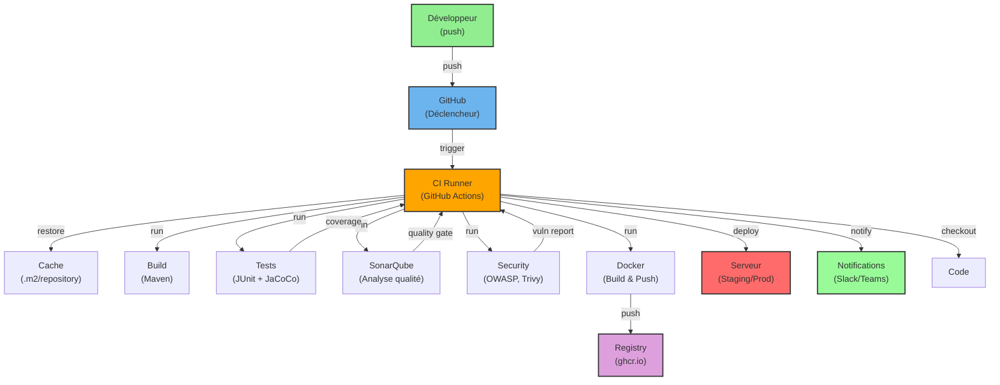

# CI/CD Pipeline - Stratégie Complète

## Table des Matières
1. [Stratégie de Branches](#1-stratégie-de-branches)
2. [Déclencheurs du Pipeline](#2-déclencheurs-du-pipeline)
3. [Étapes du Pipeline](#3-étapes-du-pipeline)
4. [Schéma Conceptuel](#4-schema-conceptuel)
5. [Configuration des Outils](#5-configuration-des-outils)

---

## 1. Stratégie de Branches

### 1.1 Modèle: GitFlow Simplifié

```
┌─────────────────────────────────────────────────────────────────────────┐
│                          GITFLOW SIMPLIFIÉ                             │
├─────────────────────────────────────────────────────────────────────────┤
│                                                                         │
│   main ─────────────────────────────────────────────────────────►       │
│    │                                                                    │
│    │    ┌──────────────┐                                               │
│    │    │              │                                               │
│    └───►│   release/*  │◄───────────────────────────────────┐          │
│         │              │                                    │          │
│         └──────────────┘                                    │          │
│              │                                               │          │
│              ▼                                               │          │
│   develop ───────────────────────────────────────────────►   │          │
│    │                                                    │    │          │
│    │    ┌─────────┐    ┌─────────┐    ┌─────────┐       │    │          │
│    ├───►│feature1│───►│feature2│───►│feature3│───────┼────┘          │
│    │    └─────────┘    └─────────┘    └─────────┘                      │
│    │                                                                    │
│    │    ┌─────────────┐                                                │
│    └───►│  hotfix/*   │───────────────────────────────────►           │
│         └─────────────┘                                                │
│                                                                         │
└─────────────────────────────────────────────────────────────────────────┘
```

### 1.2 Structure des Branches

| Branche | Rôle | Protection |
|---------|------|------------|
| `main` | Production - Code stable | ✓ Required PR ✓ Required Reviews |
| `develop` | Integration - Derniers développements | ✓ Required PR |
| `feature/*` | Nouvelles fonctionnalités | Pull Request |
| `release/*` | Préparation release | Pull Request |
| `hotfix/*` | Corrections urgentes | Pull Request |

### 1.3 Règles de Protection des Branches

**Main (Production):**
- ✓ Required PR avec 2 approbations
- ✓ Status checks passés (CI/CD)
- ✓ Pas de force push
- ✓ Require signed commits
- ✓ Require linear history

**Develop:**
- ✓ Required PR avec 1 approbation
- ✓ Status checks passés
- ✓ Pas de force push

---

## 2. Déclencheurs du Pipeline

### 2.1 Événements GitHub Actions

| Événement | Branche(s) | Action |
|-----------|------------|--------|
| `push` | `main`, `develop` | CI complète |
| `pull_request` | `main`, `develop` | Tests + Analyse |
| `release` | `tag v*` | Déploiement auto |
| `schedule` | - | Nightly security scan |
| `workflow_dispatch` | - | Déploiement manuel |

### 2.2 Schedule (Nightly Build)

```yaml
schedule:
  # Security scan chaque jour à 2h du matin
  - cron: '0 2 * * *'
```

### 2.3 Tags pour Déploiement

```
v1.0.0  → Production
v1.0.0-rc1 → Staging (Release Candidate)
v1.0.0-beta → Test
```

---

## 3. Étapes du Pipeline

### 3.1 Schéma Global du Pipeline

```
┌──────────────────────────────────────────────────────────────────────────────┐
│                          PIPELINE CI/CD TASK MANAGER                        │
├──────────────────────────────────────────────────────────────────────────────┤
│                                                                              │
│  [PUSH/PR] ──► [CHECKOUT] ──► [CACHE] ──► [BUILD] ──► [LINT] ──► [TESTS]    │
│      │                                              │            │            │
│      │                                              │            ▼            │
│      │                                              │     ┌─────────────┐    │
│      │                                              │     │ UNIT TESTS  │    │
│      │                                              │     │   + COV.    │    │
│      │                                              │     └─────────────┘    │
│      │                                              │            │            │
│      │                                              ▼            ▼            │
│      │                                        ┌──────────┐ ┌───────────┐     │
│      │                                        │CHECKSTYLE│ │  INTEGR.  │     │
│      │                                        │   PMD    │ │   TESTS   │     │
│      │                                        │SPOTBUGS  │ │  (MySQL)  │     │
│      │                                        └──────────┘ └───────────┘     │
│      │                                              │            │            │
│      ▼                                              ▼            ▼            │
│  [SONARQUBE] ──────────────────────────────────► [QUALITY] ◄─────────┘     │
│      │                                              │                       │
│      │                                              ▼                       │
│      │                                        ┌─────────────┐               │
│      │                                        │ QUALITY GATE│               │
│      │                                        │ (70% cov.)  │               │
│      │                                        └─────────────┘               │
│      │                                              │                       │
│      ▼                                              ▼                       │
│  [SECURITY] ──────────────────────────────────► [PASS/FAIL]               │
│      │                                              │                       │
│      │    ┌────────────────┐                       │                       │
│      ├───►│OWASP DEP. CHECK│                       │                       │
│      │    ├────────────────┤                       │                       │
│      ├───►│   TRIVY SCAN   │                       │                       │
│      │    ├────────────────┤                       │                       │
│      └───►│  GITLEAKS      │                       │                       │
│           └────────────────┘                       ▼                       │
│                                                      │                       │
│  [BUILD DOCKER] ◄───────────────────────────────────┘                       │
│      │                                                                      │
│      │    ┌────────────────┐                                                │
│      ├───►│  DOCKER BUILD  │                                                │
│      │    ├────────────────┤                                                │
│      └───►│DOCKER PUSH GHCR│                                                │
│           └────────────────┘                                                │
│                  │                                                          │
│                  ▼                                                          │
│  [DEPLOY] ◄─────────────────────────────────────────────┘                   │
│      │                                                                      │
│      │    ┌─────────────┐      ┌─────────────┐                              │
│      ├───►│   STAGING   │──────│  PRODUCTION │                              │
│      │    │ (develop)   │      │   (main)    │                              │
│      │    └─────────────┘      └─────────────┘                              │
│      │                                                                      │
│      ▼                                                                      │
│  [NOTIFY] ──► [SLACK/TEAMS/DISCORD]                                        │
│                                                                              │
└──────────────────────────────────────────────────────────────────────────────┘
```

### 3.2 Détail de Chaque Étape

---

#### ÉTAPE 1: BUILD
```
┌─────────────────────────────────────────────────────────────┐
│  ÉTAPE 1: BUILD                                             │
├─────────────────────────────────────────────────────────────┤
│  Objectif: Compiler le code, vérifier qu'il n'y a pas     │
│            d'erreurs de compilation                         │
├─────────────────────────────────────────────────────────────┤
│  Commande:                                                   │
│    ./mvnw clean package -DskipTests                         │
├─────────────────────────────────────────────────────────────┤
│  Artefacts générés:                                         │
│    • target/*.jar (application JAR)                        │
│    • target/classes/ (bytecode)                            │
├─────────────────────────────────────────────────────────────┤
│  Cache:                                                     │
│    .m2/repository (dépendances Maven)                       │
├─────────────────────────────────────────────────────────────┤
│  Duration: ~2-3 minutes                                     │
│  Environment: ubuntu-latest                                │
│  Java: 17 (Temurin)                                         │
└─────────────────────────────────────────────────────────────┘
```

---

#### ÉTAPE 2: LINT / CODE QUALITY
```
┌─────────────────────────────────────────────────────────────┐
│  ÉTAPE 2: LINT / CODE QUALITY                               │
├─────────────────────────────────────────────────────────────┤
│  Objectif: Vérifier le style de code, conventions,         │
│            règles de codage                                │
├─────────────────────────────────────────────────────────────┤
│  OUTILS:                                                    │
│  ┌─────────────────┬────────────────────────────────────┐  │
│  │ Checkstyle     │ Vérifie les conventions Java      │  │
│  │                 │ (naming, indentation, imports)    │  │
│  ├─────────────────┼────────────────────────────────────┤  │
│  │ PMD            │ Analyse statique du code           │  │
│  │                 │ (best practices, design, perform.)│  │
│  ├─────────────────┼────────────────────────────────────┤  │
│  │ SpotBugs       │ Détection de bugs potentiels      │  │
│  │                 │ (null pointer, ressources, etc.)   │  │
│  └─────────────────┴────────────────────────────────────┘  │
├─────────────────────────────────────────────────────────────┤
│  Commandes:                                                 │
│    ./mvnw checkstyle:check                                 │
│    ./mvnw pmd:pmd                                          │
│    ./mvnw spotbugs:spotbugs                               │
├─────────────────────────────────────────────────────────────┤
│  Rapports:                                                  │
│    • target/checkstyle-result.xml                         │
│    • target/pmd.xml                                       │
│    • target/spotbugsXml.xml                               │
├─────────────────────────────────────────────────────────────┤
│  Configuration: failOnViolation = false                    │
│  (Avertissements mais pas d'échec)                        │
├─────────────────────────────────────────────────────────────┤
│  Duration: ~1-2 minutes                                    │
└─────────────────────────────────────────────────────────────┘
```

---

#### ÉTAPE 3: TESTS UNITAIRES
```
┌─────────────────────────────────────────────────────────────┐
│  ÉTAPE 3: TESTS UNITAIRES                                  │
├─────────────────────────────────────────────────────────────┤
│  Objectif: Valider le comportement du code                 │
├─────────────────────────────────────────────────────────────┤
│  Commande:                                                   │
│    ./mvnw test                                             │
├─────────────────────────────────────────────────────────────┤
│  Couverture (JaCoCo):                                       │
│    • Minimum: 70% LINE, 70% BRANCH                          │
│    • Rapport: target/site/jacoco/index.html               │
│    • XML: target/jacoco.xml                               │
├─────────────────────────────────────────────────────────────┤
│  Rapports:                                                  │
│    • target/surefire-reports/*.xml                        │
│    • target/site/jacoco/index.html                        │
├─────────────────────────────────────────────────────────────┤
│  Services:                                                  │
│    • MySQL 8.0 (integration tests)                        │
│    • Health check avant les tests                         │
├─────────────────────────────────────────────────────────────┤
│  Duration: ~3-5 minutes                                    │
│  Env vars:                                                  │
│    SPRING_PROFILES_ACTIVE=test                             │
│    SPRING_DATASOURCE_URL=jdbc:mysql://localhost:3306/... │
└─────────────────────────────────────────────────────────────┘
```

---

#### ÉTAPE 4: ANALYSE SONARQUBE
```
┌─────────────────────────────────────────────────────────────┐
│  ÉTAPE 4: ANALYSE SONARQUBE                                │
├─────────────────────────────────────────────────────────────┤
│  Objectif: Mesurer la qualité, dette technique, bugs       │
├─────────────────────────────────────────────────────────────┤
│  Commande:                                                   │
│    ./mvnw sonar:sonar                                      │
├─────────────────────────────────────────────────────────────┤
│  Paramètres (CI):                                           │
│    SONAR_HOST_URL: ${{ secrets.SONAR_HOST_URL }}          │
│    SONAR_TOKEN: ${{ secrets.SONAR_TOKEN }}                │
│    SONAR_PROJECT_KEY: taskmanager                          │
├─────────────────────────────────────────────────────────────┤
│  QUALITY GATE:                                              │
│  ┌─────────────────────┬────────────────────────────────┐  │
│  │ Métrique            │ Seuil                          │  │
│  ├─────────────────────┼────────────────────────────────┤  │
│  │ Coverage           │ > 70%                          │  │
│  ├─────────────────────┼────────────────────────────────┤  │
│  │ Bugs               │ = 0                            │  │
│  ├─────────────────────┼────────────────────────────────┤  │
│  │ Code Smells        │ < 100                          │  │
│  ├─────────────────────┼────────────────────────────────┤  │
│  │ Vulnerabilities    │ = 0                            │  │
│  ├─────────────────────┼────────────────────────────────┤  │
│  │ Security Hotspots  │ < 10                           │  │
│  └─────────────────────┴────────────────────────────────┘  │
├─────────────────────────────────────────────────────────────┤
│  Rapport:                                                   │
│    target/sonar/report-taskmanager.html                    │
├─────────────────────────────────────────────────────────────┤
│  Duration: ~2-3 minutes                                    │
└─────────────────────────────────────────────────────────────┘
```

---

#### ÉTAPE 5: SÉCURITÉ
```
┌─────────────────────────────────────────────────────────────┐
│  ÉTAPE 5: SCANS SÉCURITÉ                                   │
├─────────────────────────────────────────────────────────────┤
│  OUTILS:                                                    │
│  ┌─────────────────────┬────────────────────────────────┐  │
│  │ OWASP Dependency    │ Scan des vulnérabilités dans   │  │
│  │ Check               │ les dépendances Maven           │  │
│  ├─────────────────────┼────────────────────────────────┤  │
│  │ Trivy               │ Scan de l'image Docker         │  │
│  │                     │ (vulnérabilités, secrets)       │  │
│  ├─────────────────────┼────────────────────────────────┤  │
│  │ GitLeaks            │ Détection de secrets dans      │  │
│  │                     │ le code (tokens, mots de passe) │  │
│  └─────────────────────┴────────────────────────────────┘  │
├─────────────────────────────────────────────────────────────┤
│  OWASP Dependency Check:                                    │
│    ./mvnw org.owasp:dependency-check-maven:check          │
│    failBuildOnCVSS: 7 (Bloque si score >= 7)              │
│    Rapport: target/dependency-check-report.html            │
├─────────────────────────────────────────────────────────────┤
│  Trivy Image Scan:                                          │
│    docker build -t taskmanager:scan .                      │
│    trivy image --format sarif taskmanager:scan             │
│    Rapport: trivy-results.sarif                           │
├─────────────────────────────────────────────────────────────┤
│  GitLeaks:                                                  │
│    Action: gitleaks/gitleaks-action                        │
│    Continue-on-error: true (alerte mais pas bloquant)     │
├─────────────────────────────────────────────────────────────┤
│  Duration: ~2-4 minutes                                    │
└─────────────────────────────────────────────────────────────┘
```

---

#### ÉTAPE 6: BUILD DOCKER
```
┌─────────────────────────────────────────────────────────────┐
│  ÉTAPE 6: BUILD DOCKER IMAGE                               │
├─────────────────────────────────────────────────────────────┤
│  Objectif: Construire et pousser l'image Docker             │
├─────────────────────────────────────────────────────────────┤
│  Registry: GitHub Container Registry (ghcr.io)              │
│  Image: ghcr.io/<owner>/taskmanager                         │
├─────────────────────────────────────────────────────────────┤
│  Tags:                                                      │
│    • {{ branch }}-{{ sha }}                                │
│    • {{ version }} (semver)                                │
│    • latest (sur main)                                     │
├─────────────────────────────────────────────────────────────┤
│  Build:                                                     │
│    docker build -t $IMAGE:$TAG .                           │
│    docker push $IMAGE:$TAG                                 │
├─────────────────────────────────────────────────────────────┤
│  Cache:                                                     │
│    BuildKit cache from GitHub Actions (GHA)               │
│    Mode: max                                               │
├─────────────────────────────────────────────────────────────┤
│  Metadata:                                                  │
│    docker/metadata-action pour les labels                 │
│    Labels: version, commit, branch                         │
├─────────────────────────────────────────────────────────────┤
│  Duration: ~3-5 minutes (avec cache)                      │
│  Size: ~150-200 MB (JRE Alpine)                            │
└─────────────────────────────────────────────────────────────┘
```

---

#### ÉTAPE 7: DÉPLOIEMENT
```
┌─────────────────────────────────────────────────────────────┐
│  ÉTAPE 7: DÉPLOIEMENT                                      │
├─────────────────────────────────────────────────────────────┤
│  ENVIRONNEMENTS:                                           │
│  ┌───────────────┬──────────────────────────────────────┐  │
│  │ Staging       │ develop branch                       │  │
│  │ URL:          │ https://taskmanager.staging...      │  │
│  │ Image:        │ branch-sha tag                       │  │
│  ├───────────────┼──────────────────────────────────────┤  │
│  │ Production    │ main branch                         │  │
│  │ URL:          │ https://taskmanager.prod...         │  │
│  │ Image:        │ latest, v*.*.* tag                  │  │
│  └───────────────┴──────────────────────────────────────┘  │
├─────────────────────────────────────────────────────────────┤
│  STRATÉGIE DE DÉPLOIEMENT:                                  │
│    • Rolling Update (Kubernetes)                           │
│    • Blue-Green (Docker Swarm)                              │
│    • Canary (optionnel)                                     │
├─────────────────────────────────────────────────────────────┤
│  HEALTH CHECK:                                             │
│    curl -f https://.../actuator/health                    │
│    Interval: 30s, Timeout: 10s                            │
├─────────────────────────────────────────────────────────────┤
│  ROLLBACK:                                                  │
│    • Automatique si health check échoue                    │
│    • Manuel via GitHub Actions                            │
├─────────────────────────────────────────────────────────────┤
│  Duration: ~2-5 minutes (selon infrastructure)            │
└─────────────────────────────────────────────────────────────┘
```

---

#### ÉTAPE 8: NOTIFICATIONS
```
┌─────────────────────────────────────────────────────────────┐
│  ÉTAPE 8: NOTIFICATIONS                                     │
├─────────────────────────────────────────────────────────────┤
│  CANAUX:                                                    │
│  ┌─────────────────┬────────────────────────────────────┐  │
│  │ Slack/Teams    │ Notifications de succès/échec     │  │
│  ├─────────────────┼────────────────────────────────────┤  │
│  │ Discord        │ Messages avec détails du build    │  │
│  ├─────────────────┼────────────────────────────────────┤  │
│  │ GitHub Issues  │ Création auto si échec             │  │
│  └─────────────────┴────────────────────────────────────┘  │
├─────────────────────────────────────────────────────────────┤
│  CONTENU NOTIFICATION:                                      │
│    • Pipeline: CI/CD                                       │
│    • Status: SUCCESS/FAILURE                                │
│    • Branch: refs/heads/main                               │
│    • Commit: abc1234                                       │
│    • Run: #123                                             │
│    • URL: Lien vers le run GitHub Actions                 │
├─────────────────────────────────────────────────────────────┤
│  SECRETS REQUIS:                                            │
│    • DISCORD_WEBHOOK (si Discord utilisé)                 │
│    • SLACK_WEBHOOK (si Slack utilisé)                    │
│    • TEAMS_WEBHOOK (si Teams utilisé)                     │
└─────────────────────────────────────────────────────────────┘
```

---

## 4. Schéma Conceptuel des Interactions

### 4.1 Diagramme Mermaid



### 4.2 Diagramme Texte

```
┌─────────────────────────────────────────────────────────────────────────────────┐
│                        SCHÉMA DES INTERACTIONS CI/CD                          │
├─────────────────────────────────────────────────────────────────────────────────┤
│                                                                                 │
│  [DÉVELOPPEUR]                                                                 │
│       │                                                                        │
│       │ push (commit, branch)                                                  │
│       ▼                                                                        │
│  ┌─────────────┐                                                               │
│  │   GITHUB    │  Déclencheur du pipeline                                      │
│  │  (Actions)  │  • push sur main/develop                                      │
│  └──────┬──────┘  • pull_request                                               │
│         │        • release (tag v*)                                             │
│         │        • schedule (nightly)                                           │
│         ▼                                                                        │
│  ┌─────────────────────┐                                                        │
│  │   CI RUNNER        │  Environnement d'exécution                            │
│  │  (ubuntu-latest)   │  • Java 17                                             │
│  └──────────┬──────────┘  • Maven 3.9+                                         │
│             │                                                                  │
│    ┌────────┴────────┬──────────────┬──────────────┐                       │
│    ▼                  ▼              ▼              ▼                        │
│  ┌─────────┐    ┌───────────┐  ┌──────────┐  ┌───────────┐                 │
│  │  BUILD  │    │   TESTS   │  │  SONAR   │  │ SECURITY  │                 │
│  │ Maven  │    │ JUnit/JaCo│  │  Qube    │  │  OWASP/   │                 │
│  │ Clean  │    │   Co      │  │          │  │  Trivy    │                 │
│  │Package │    │           │  │          │  │           │                 │
│  └────┬────┘    └─────┬─────┘  └─────┬─────┘  └─────┬─────┘                 │
│       │               │              │              │                        │
│       │               │              │ quality_gate  │                        │
│       │               │              │◄──────────────┘                        │
│       │               │              │                                           │
│       │               │              ▼                                           │
│       │               │      ┌─────────────────┐                               │
│       │               │      │  QUALITY GATE   │                               │
│       │               │      │  • 70% coverage │                               │
│       │               │      │  • 0 bugs       │                               │
│       │               │      │  • 0 vulnerab.  │                               │
│       │               │      └────────┬────────┘                               │
│       │               │               │                                          │
│       │               └───────────────┼──────────────────────────────────────  │
│       │                               │                                          │
│       │                               ▼                                          │
│       │                     ┌─────────────────────┐                            │
│       │                     │    BUILD DOCKER     │                            │
│       │                     │  • Multi-stage      │                            │
│       │                     │  • BuildKit cache   │                            │
│       │                     └──────────┬──────────┘                            │
│       │                                │                                         │
│       │                                ▼                                         │
│       │                     ┌─────────────────────┐                            │
│       │                     │    PUSH REGISTRY     │                            │
│       │                     │    (ghcr.io)         │                            │
│       │                     │  • taskmanager:tag  │                            │
│       │                     │  • taskmanager:lat.. │                            │
│       │                     └──────────┬──────────┘                            │
│       │                                │                                         │
│       │                                ▼                                         │
│       │                     ┌─────────────────────┐                            │
│       │                     │   DEPLOYMENT       │                            │
│       │                     │ ┌─────────────────┐ │                            │
│       │                     │ │    STAGING      │ │                            │
│       │                     │ │ (develop branch)│ │                            │
│       │                     │ └─────────────────┘ │                            │
│       │                     │ ┌─────────────────┐ │                            │
│       │                     │ │   PRODUCTION   │ │                            │
│       │                     │ │ (main branch)  │ │                            │
│       │                     │ └─────────────────┘ │                            │
│       │                     └──────────┬──────────┘                            │
│       │                                │                                         │
│       │                                ▼                                         │
│       │                     ┌─────────────────────┐                            │
│       │                     │   HEALTH CHECK      │                            │
│       │                     │ /actuator/health    │                            │
│       │                     └──────────┬──────────┘                            │
│       │                                │                                         │
│       │                    ┌───────────┴───────────┐                          │
│       │                    │                       │                          │
│       │                    ▼                       ▼                          │
│       │            ┌───────────────┐      ┌────────────────┐                  │
│       │            │    SUCCESS    │      │    FAILURE     │                  │
│       │            │               │      │                │                  │
│       │            └───────┬───────┘      └───────┬────────┘                  │
│       │                    │                      │                            │
│       │                    ▼                      ▼                            │
│       │            ┌───────────────┐      ┌────────────────┐                  │
│       │            │ NOTIFICATIONS │      │ NOTIFICATIONS  │                  │
│       │            │ + ARTIFACTS    │      │ + GITHUB ISSUE │                  │
│       │            │ (Slack/Teams) │      │                │                  │
│       │            └───────────────┘      └────────────────┘                  │
│       │                                                                  │
│       │                                                                  │
│       └───────────────────────────────────────────────────────────────►      │
│                           RETOUR AU DÉVELOPPEUR                               │
│                                                                                 │
└─────────────────────────────────────────────────────────────────────────────────┘
```

---

## 5. Configuration des Outils

### 5.1 Secrets GitHub Requispens

| Secret | Description | Exemple |
|--------|-------------|---------|
| `SONAR_HOST_URL` | URL du serveur SonarQube | `https://sonarcloud.io` |
| `SONAR_TOKEN` | Token d'authentification SonarQube | `sonarcloud_token` |
| `DISCORD_WEBHOOK` | Webhook Discord | `https://discord.com/api/webhooks/...` |
| `SLACK_WEBHOOK` | Webhook Slack | `https://hooks.slack.com/services/...` |
| `DOCKER_USERNAME` | Username Docker Hub/GHCR | `${{ github.actor }}` |
| `DOCKER_TOKEN` | Token Docker | `${{ secrets.GITHUB_TOKEN }}` |

### 5.2 Variables d'Environnement

| Variable | Valeur par défaut |
|----------|-------------------|
| `JAVA_VERSION` | `17` |
| `DOCKER_BUILDKIT` | `1` |
| `REGISTRY` | `ghcr.io` |
| `IMAGE_NAME` | `${{ github.repository }}` |

---

## 6. Métriques et Observabilité

### 6.1 Métriques du Pipeline

| Métrique | Description | Cible |
|----------|-------------|-------|
| Pipeline Duration | Temps total d'exécution | < 15 min |
| Build Success Rate | Taux de succès des builds | > 90% |
| Test Coverage | Couverture de code | > 70% |
| Critical Vulnerabilities | Vulnérabilités critiques | = 0 |
| Mean Time to Recovery (MTTR) | Temps de récupération | < 30 min |

### 6.2 Observabilité

```
┌─────────────────────────────────────────────────────────────┐
│                    OBSERVABILITÉ CI/CD                       │
├─────────────────────────────────────────────────────────────┤
│                                                             │
│  ┌─────────────┐  ┌─────────────┐  ┌─────────────┐        │
│  │   Logs      │  │  Métriques  │  │  Alertes    │        │
│  │  Pipeline   │  │  GitHub     │  │  Slack/     │        │
│  │             │  │  Actions    │  │  Teams      │        │
│  └─────────────┘  └─────────────┘  └─────────────┘        │
│        │                │                │                  │
│        └────────────────┴────────────────┘                  │
│                         │                                   │
│                         ▼                                   │
│              ┌─────────────────────┐                        │
│              │   Dashboards        │                        │
│              │   • Build stats     │                        │
│              │   • Coverage trends │                        │
│              │   • Quality gates   │                        │
│              └─────────────────────┘                        │
│                                                             │
└─────────────────────────────────────────────────────────────┘
```

---

## 7. Fichiers Créés

| Fichier | Description |
|---------|-------------|
| `.github/workflows/ci-cd.yml` | Pipeline GitHub Actions |
| `checkstyle.xml` | Règles Checkstyle |
| `pmd-ruleset.xml` | Règles PMD |
| `dependency-check-suppressions.xml` | Suppressions OWASP |
| `docs/CI-CD-STRATEGY.md` | Cette documentation |

---

## 8. Prochaines Étapes

1. **Configurer les secrets GitHub** (SONAR_HOST_URL, SONAR_TOKEN, etc.)
2. **Configurer SonarCloud** ou installer SonarQube local
3. **Configurer les règles de protection des branches** sur GitHub
4. **Configurer les webhooks** Slack/Discord/Teams
5. **Adapter les scripts de déploiement** (Kubernetes, Ansible, etc.)
6. **Activer Dependabot** pour les mises à jour automatiques

---

*Document généré pour Task Manager Application - Spring Boot*
*Version: 1.0.0*

